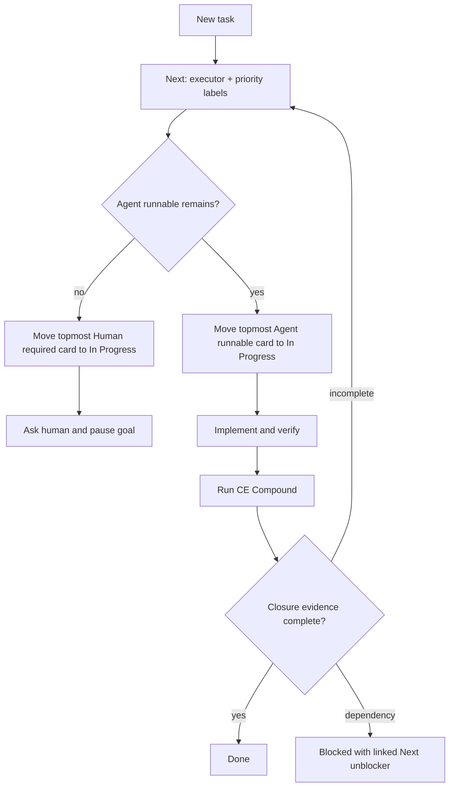

# Agent Kanban Governance - Plan

## Goal Capsule

- **Objective:** Publish Agent Kanban as the canonical skill for a memory-less agent operating a durable, human-legible work queue.
- **Product authority:** The user's queue, closure, executor, priority, and human-handoff decisions in this thread.
- **Open blockers:** Upstream CE Compound PR #662 must land, or an equivalent supported non-interactive depth selector must be available, to make Lightweight closure efficient.

---

## Product Contract

### Summary

Agent Kanban keeps task state truthful while letting an agent execute continuously without taking priority authority away from the human. It requires full remediation before investigations close and deposits reusable learning before any completed card reaches Done.

### Key Decisions

- **Canonical identity:** The skill is named `agent-kanban`; prior Agent Task OS naming is migration vocabulary only.
- **Human priority authority:** Backlog↔Next movement belongs to the human by default. Agent exceptions require a card note that names the governing invariant and evidence.
- **Executable queue:** Next is ordered first by executor class and then by three-level priority.
- **Strict closure:** Investigation analysis and follow-up filing are not substitutes for implementing and verifying the complete remediation plan.

### Requirements

**Queue identity and authority**

- R1. New tasks enter Next by default without interrupting the current In Progress card.
- R2. Backlog↔Next moves require a human decision unless a verified invariant or explicit standing instruction requires an exception with an explanation note.
- R3. Every Next card carries exactly one executor label and exactly one priority label.
- R4. Executor labels are `Agent runnable` and `Human required`; priority labels are `Priority: High`, `Priority: Normal`, and `Priority: Low`.
- R5. New tasks default to `Priority: Normal` unless user direction or verified impact establishes another level.
- R5a. Next is a priority-bucketed stack. New High, Normal, and Low cards enter at the top of their respective buckets; the next promotion is always the topmost Agent runnable card.

**Queue ordering and handoff**

- R6. Agent-runnable cards precede every human-required card, with High → Normal → Low ordering inside each executor class.
- R7. A human-required card cannot enter In Progress while any agent-runnable card remains in Next.
- R8. When only human-required cards remain, the first enters In Progress, the agent asks for the required action or decision, and the goal pauses until the human responds.

**Blocked relationships**

- R9. Every Blocked card links to at least one concrete active blocker in Next, In Progress, or Blocked.
- R10. An unblocker in Next declares whether the agent or human must execute it through its executor label.
- R11. Blocked-to-Blocked links form an acyclic dependency graph; a card without an active linked blocker cannot remain Blocked, and the parent returns to Next when its final direct blocker reaches Done.
- R11a. Reject cycle-forming edges. Repair an inherited cycle by removing its provably newest edge; if recency is unknowable, move participants to Backlog with lifecycle-exception notes and create a High-priority Human required Next card to establish the dependency order.
- R11b. If Agent runnable work arrives during a pending human handoff, return the human card to its Next bucket and resume the topmost Agent runnable task.

**Closure and compounding**

- R12. An investigation enters Done only after every applicable remediation phase is implemented and directly verified.
- R13. Checked analysis phases, documentation, honest failure reporting, accepted limitations, or follow-up cards cannot satisfy R12.
- R14. CE Compound runs after implementation verification but before the card enters Done.
- R15. CE Compound defaults to Lightweight and escalates for security or production incidents, repeated failures, cross-cutting work, likely documentation overlap, or an explicit instruction.
- R16. A legitimate no-learning result satisfies the compounding gate, while execution failure opens an investigation and keeps the original card out of Done.

### Queue Flow

### Acceptance Examples

- AE1. **Covers R5a, R6–R8.** Given one Normal agent card and one High human card in Next, a newly added Normal agent card enters at the top of the Normal agent bucket and enters In Progress first; the human card waits until no agent-runnable cards remain.
- AE2. **Covers R9–R11.** Given A blocked by B and B blocked by C, the chain remains valid while its edges are acyclic. An attempted C → A edge is rejected with the cycle path; each parent returns to Next after its final direct blocker reaches Done.
- AE3. **Covers R12–R13.** Given a completed investigation checklist whose remediation file still says a structural fix is deferred, the investigation cannot enter Done.
- AE4. **Covers R14–R16.** Given verified ordinary work, Lightweight compounding runs before Done; a valid no-op proceeds, while a tool failure opens an investigation.

### Scope Boundaries

- Agent Kanban governs queue semantics and caller policy; it does not fork CE Compound's public invocation contract inside this skill.
- Repository and installation-path renames must preserve a documented migration path for existing consumers.
- Priority labels express ordering, not deadlines, severity, or incident classification.

### Dependencies / Assumptions

- EveryInc/compound-engineering-plugin PR #662 provides the intended `mode:autofix depth:lightweight|standard|deep` capability.
- The task substrate can create labels, link cards, read list membership, and verify mutations through an independent model read.

### Sources / Research

- EveryInc/compound-engineering-plugin PR #662: non-interactive CE Compound depth selection.
- `SKILL.md`: current Agent Kanban operating contract.
- `tests/skill-contract.sh`: deterministic governance assertions.
